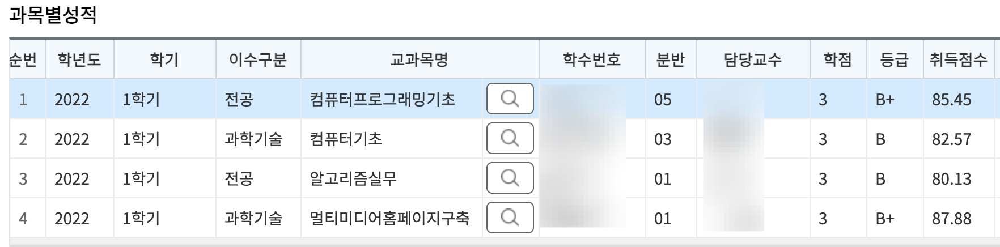
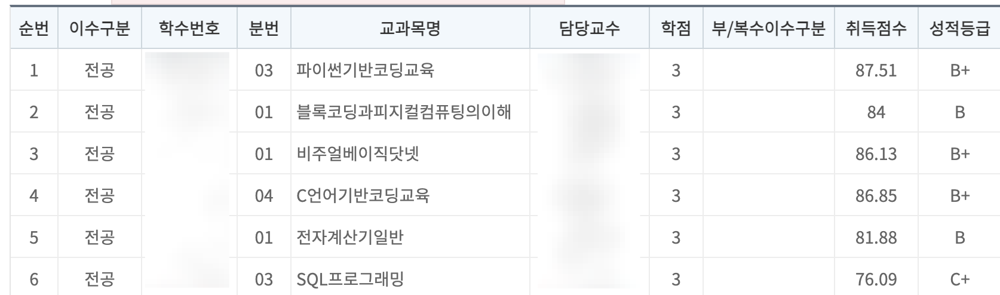
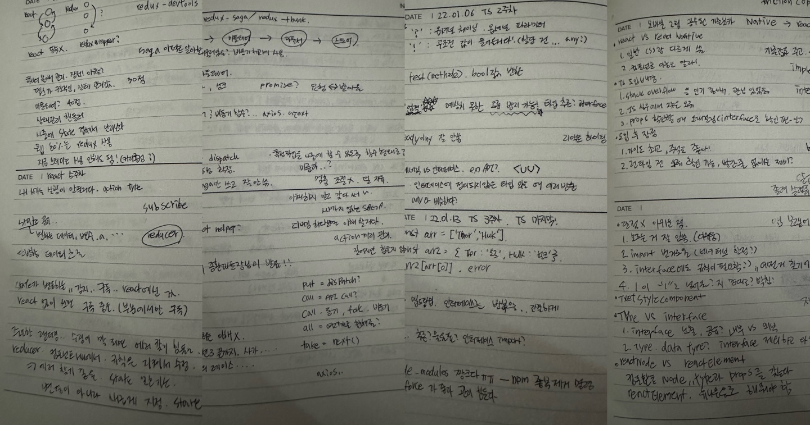
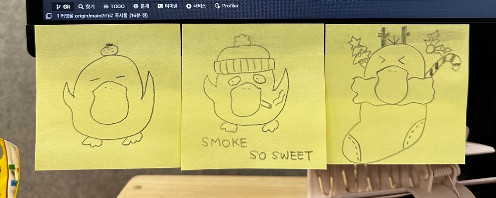

## 사이버 대학교

졸업장 반, 더 배우고 싶은 마음 반 이였지만 실제로 공부를 한 기억은 잘 나지 않는다 🤣

다만... 시험을 풀며 얼추 개념과 얕은 지식은 꽤 많이 알아갔다!

아마 앞으로도 이 정도를 유지할 것 같다

---

## 사내 스터디

### [ppotatoG/study/typescript](https://github.com/ppotatoG/study/tree/master/typescript)

개발팀 전체에서 모집했지만, 퍼블리셔만 7명ㅋㅋㅋ

OT로 고기 먹는데 나한테 어그로 끌리는 게 부끄러워서 울어버리고
 

매주 발표한다길래 낯을 많이 가려 걱정했지만 걱정 한 거에 비해 정말 잘했다 🤪

마지막 주에는 개발팀 내 `ts` 도입한 모바일팀 파트장님이 도입 후기에 대해 발표도 해주셨다
 

발표 당시 `react` 를 해보지 못한 상태였기 때문에 이해에 어려움이 있었지만

여러 내용을 최대한 필기하며 이해하려 노력했다
 

### [ppotatoG/NodeBirdSNS](https://github.com/ppotatoG/NodeBirdSNS)

`ts` 대비 어려워 보여서인지 시작부터 인원이 너무 적어 잘할 수 있을까? 라는 마음으로 시작했다
 

스터디 진행하며 작성한 [노트](https://github.com/ppotatoG/study/tree/master/node-bird-sns)를 보면 정말 웃기다 ㅋㅋㅋ
 

이 때 진행했던 것 덕분에 간단한 `react`의 전반적인 얕은 지식을 알 수 있었고

이 스터디 덕분에 여태까지 `react`를 잘할 수 있는 것 같다!

---

## 왕고 퍼블리셔

다른 왕고들이 그만두고 자연스레 왕고가 되었다
 

24살.. 만 2년 차.... 나 따위가 왕고ㅠㅠ?

덕분에 많이 울고 웃고 성장할 수 있었던 것 같다
 

어린데다가 연차도 적은 나를 우대해주시고,

내가 지적하는 것에 대해 적극 수용해주시고 성장하는 언니들을 보며 나도 많이 배웠다
 

퇴사하는 날 장문의 편지 및 많은 선물을 받았고 아직까지 연을 이어 나가고 있다
 

앞으로도 쭉 오래 보고싶은 사람들이다 ❤️

---

## 성공적인 마지막 프로젝트

바쁘고 정신없어 매일 야근하는 와중에 너무 욕심나서 내가 맡은 프로젝트

마지막인만큼 정말 열심히 하려 노력했고 아주 만족스럽다
 

날것의 `html`로 돌아가는 페이지에서 `scss`와 `jquery`를 활용해 최대한 컴포넌트의 느낌으로 뺄 수 있도록 작업했다

모바일 프로젝트임에 따라 safeArea 또는 스크롤 이벤트는 정말 까다롭게 진행했으며

QA 까지 진행하여 더욱 완성도 있는 결과물을 볼 수 있어 행복했다
 

다만.... QA 완료가 6월 이였는데 왜 아직도 배포가 안된걸까 🥲

---

## 개발자 준비
[Resume](https://abyssinian-meerkat-3d0.notion.site/Resume-0aae470d453f4996add1a57661fff076)

처음부터 프론트엔드를 목표로 퍼블리셔를 시작한 나이기에 항상 뚜렷한 목표를 갖고 공부할 수 있었다

현재 회사가 충분히 안정적이고 우대받고 있음에도 더 나아가고 싶은 마음으로 이직을 준비했다
 

사실~ 태어나서 이렇게 열심히 취업을 위해 준비해 본 적도 없으며 자기소개서를 열정적으로 적어본 적도 처음이였다ㅠㅠ

살면서 면접에서 떨어본 적이 없는 나지만, 많은 면접을 진행하며 떤 적도 여럿 있었다
 

취업준비는 정말 힘들고 어렵고 자괴감에 빠지는 연속이였다ㅠㅠ
 

9월부터 12월까지 약 300번의 지원, 14 회사와의 면접, 4개의 최종 합격이 있었다

나름 신입치고 꽤 괜찮은 스펙과 나이 열정이라 생각했는데 실제 허들은 생각보다 더욱 높았고

다행히 현재는 만족스러운 회사에 근무 중이다 😍
 

면접 당시 모두 내 이야기를 경청하는 것은 물론 노션을 전부 프린트하여 진행했으며

개발자 두 명은 노트북으로 내 깃을 함께 보며 면접을 진행했다

면접 진행부터 정말 존중받는 느낌과 나한테 관심이 있다고 생각했고 당연히 합격이였다
 

오프더레코드로 당시 fe 신입 서류를 약 50개 정도 검토했고 그 중 **나만 면접을 진행**했다고 한다

기존 `vue`, `angular`로 진행하던 앞단을 함께 성장하자며 이번 프로젝트부터 `react`를 사용하기로 했으며

비개발자이신 팀장님도 자기 인생에 가장 신입다운 신입이라고 칭찬해주셨다
 

정말 시대가 바뀌었다 생각이 들 정도로 출근하여 카페를 자주 가고 소통을 갈구하는 회사다

카페나 사람과 어울리는 걸 잘하지 못하는 나는 사실 힘들지만

굳이 피하거나 노력하지 않을 이유는 없다 생각하여 스스로 나름의 많은 노력을 하고 있다
 

개발 실력뿐만 아닌 커뮤니케이션 능력도 뛰어나고 더불어 사람 자체도 좋다는 평을 받아보고 싶다ㅋㅋ

---

## 2023 목표

뭐 거창하게 세울 건 없고

부상이랍시고 핑계 대며 6년간 하지 않은 운동하면서 예쁜 20대 누려보고

나태해지지 말고 어떤 분야든지 스스로 만족할 정도로 노력하며 살고 싶다

